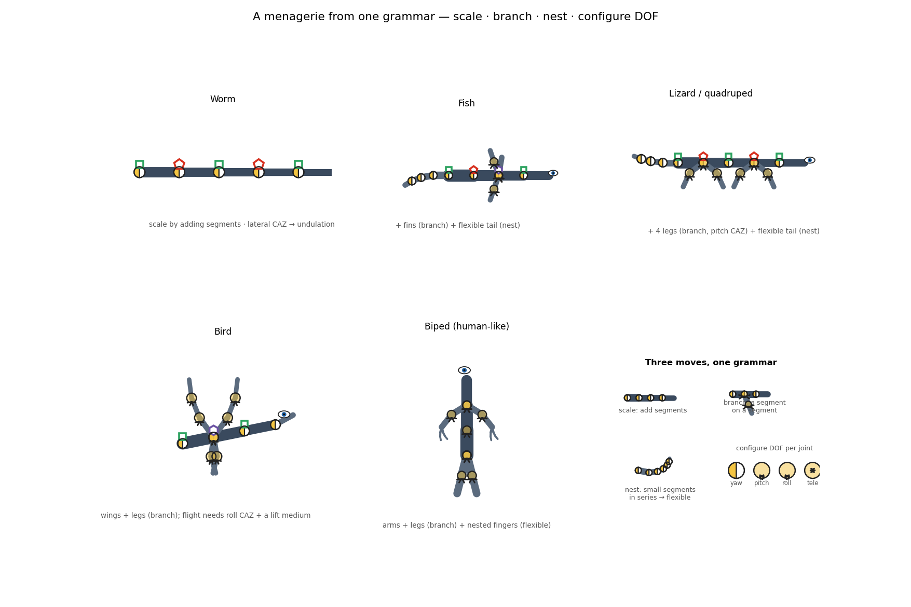

# SMN-Lab: a synthetic instrument for minimal embodied cognition

*Working draft — target: Artificial Life (MIT Press); cross-post arXiv (cs.AI; cross-list nlin.AO, q-bio.NC).*

**Authors.** G. Nagarjuna; Durgaprasad Karnam.

**Keywords.** synthetic method; embodied cognition; enactivism; minimal cognition;
morphological computation; reafference; model organism; reproducibility; artificial life.

---

## Abstract

We present **SMN-Lab**, an open-source, embodied simulation bench for the synthetic
study of minimal embodied cognition, built on MuJoCo. Designed for rigor and reuse,
the bench is organized around a single synthetic model organism — a minimal axial
crawler whose form is *derived*, not assumed, as the smallest body able to initiate
non-inertial movement and so to actively sample a world. The agent is placed in a
gravitational field **treated as a structural prior**, and its elementary unit — a
Coordinated Action Zone, an antagonistic pull-only opponent pair that both senses
and acts — is organized to **oppose that field and the forces of the medium**,
holding a dynamic equilibrium from which action departs. A network of such zones,
coupled through a *messaging beam*, realizes the body's control as morphological
computation, and the agent **constructs its world model in its own body geometry**
— a body-relative frame rather than a god's-eye coordinate system. Five design
commitments support falsifiable, reproducible experiments: a fixed model organism
varied one parameter at a time; a diagram grammar that renders any agent's
morphology, sensors, and coupling in one notation; a strict boundary between the
physics engine and the architecture; pre-registered hypotheses with matched
non-modulatory foils; and seeded, self-describing datasets. We validate the
instrument by exercising it on the Sensation Modulating Network architecture across
nine pre-registered studies; the architecture is confirmed about as often as it is
corrected — demonstrating that the bench can put a theory *at risk*. All code,
documentation, and data are openly available. SMN-Lab is offered to the
artificial-life and enactive-cognition communities as a reusable, falsifiable
testbed; we also confront the irony it embodies — an *embodied* agent inside a
*simulation* — and ask, explicitly, whether a simulation can capture embodiment and
object-directed phenomenology.

## Specifications table

| | |
|---|---|
| **Name** | SMN-Lab |
| **Subject area** | Artificial life; embodied & enactive cognitive science; minimal cognition; morphological computation |
| **Instrument type** | Open-source embodied simulation bench (MuJoCo); a model-organism testbed |
| **Closest analog** | No direct analog. Physics/robotics simulators (MuJoCo, Webots, PyBullet) are substrates; embodied-AI benchmarks (Habitat, AI2-THOR, ManiSkill) measure task performance; active-inference toolkits (pymdp, SPM) simulate the inference without a physical body; ALife platforms (Avida, Framsticks) evolve agents. SMN-Lab is a falsifiable, theory-testing bench on a derived minimal model organism. |
| **License** | GNU GPL-3.0-or-later |
| **Cost** | Free (open source) |
| **Languages / dependencies** | Python · MuJoCo · NumPy · matplotlib (Streamlit optional) |
| **Source repository** | github.com/gnowgi/smn-lab |
| **Documentation** | smn-lab.readthedocs.io |
| **Architecture reference** | Nagarjuna & Karnam, *The Sensation Modulating Network*, arXiv:2605.26856 |

---

## 1. The instrument in context  *(outline)*

- The synthetic method (understanding by building) and its **rigor gap**: embodied
  architectures are usually *illustrated* by a bespoke simulation, rarely *risked*.
- One-paragraph statement of the SMN architecture (cite arXiv:2605.26856).
- What SMN-Lab provides: a shared, falsifiable, reproducible instrument — itself the
  contribution, independent of any single theoretical result.

### 1.1 Related benches, and why we built another  *(drafted)*

The landscape of embodied simulation is crowded, yet none of it occupies SMN-Lab's
niche. We group it in five families.

*Physics and robotics simulators* — MuJoCo, PyBullet, Webots, Gazebo, Isaac —
are **substrates**: they provide forward dynamics and contacts but take no position
on cognition. In practice their dominant use is **performance optimization**. The
canonical MuJoCo benches are reward/imitation task-benchmarks organized around
standardized rewards, handcrafted metrics, and shipped state-of-the-art baselines
(DeepMind Control Suite, Tassa et al. 2018; LocoMuJoCo, Al-Hafez et al. 2023), and
the leading evolutionary-robotics work *co-optimizes* body and controller to beat
hand-designed agents (DERL, Gupta et al. 2021; Evolution Gym, Bhatia et al. 2021).
Success is *beating a baseline*. SMN-Lab is built on one such engine (MuJoCo) but
inverts the goal: it adds a cognitive architecture, a model organism, a grammar, and
an experimental discipline so the engine becomes an instrument for *testing a theory*
rather than scoring a task.

*Embodied-AI benchmarks* — Habitat, AI2-THOR, iGibson, ManiSkill, and the newer
LLM-driven suites (EmbodiedBench, ECBench) — measure **task performance**
(navigation, manipulation, instruction following), increasingly of large models
sitting atop a simulator. They ask *what an agent can do*, not whether a *theory of
how cognition is constituted* holds; the body is a vehicle for a task, not the locus
of the explanation.

*Active-inference toolkits* — pymdp, ActiveInference.jl, SPM, ForneyLab — implement
a **formalism** (Bayesian inference over discrete-state POMDPs), typically without a
physical body. They simulate the *inference*; SMN-Lab puts a body in real physics and
asks whether an architecture's *structural* claims (reafference, halt at resistance,
a body-relative world model, morphological computation) survive mechanically — the
same divergence we draw with the free-energy principle: a description of behaviour
versus the body that produces it.

*Artificial-life platforms* — Avida, Tierra, Framsticks, Polyworld — **evolve**
agents and study open-ended dynamics. They generate diversity; they do not
pre-register and falsify a *specified* architecture.

*Minimal-cognition methodology* — this is the closest in spirit and the tradition we
place ourselves in. Evolutionary robotics has long been advocated as *a scientific
tool* for studying minimal models of cognition (Harvey, Di Paolo et al. 2005);
Beer's evolved CTRNN agents are analyzed as coupled brain–body–environment dynamical
systems — "frictionless brains" — for conceptual understanding, not task scores; and
perceptual-crossing models have genuinely *tested and falsified* cognitive-
architecture hypotheses — Froese & Di Paolo (2010) refuted a proposed internal-
circuit explanation by analyzing the evolved agents' actual dynamics, and predicted
interaction patterns later observed in humans. This is hypothesis-testing done right.
But it runs on **bespoke, often non-reproducible** code: a recognized reproducibility
gap in enactive simulation (no released source) prompted the purpose-built, open
**PCE Simulation Toolkit** (Sangati & Fukushima 2023), whose stated contribution is
the *reproducibility and extensibility of cognitive-mechanism simulation* — exactly
the move SMN-Lab makes, but in **continuous MuJoCo physics** rather than discrete
CTRNN agents.

What none of these offers is what SMN-Lab is: a **shared, falsifiable instrument**
that takes a *stated architectural theory* of embodied cognition, instantiates it on
a *derived minimal model organism* in real physics, and puts its claims at risk with
matched non-modulatory foils and pre-registration — reporting when the theory is
wrong. The matched foil is the crux: it isolates *which part of the body's
organization did the work*. We are not aware of a physics-engine bench that brings
this experimental-control scaffolding to embodied-cognition hypotheses; that is the
niche SMN-Lab occupies. We are explicit that SMN-Lab is young (one organism family,
planar idealizations); the claim is about the *niche and the discipline*, not
maturity.

### 1.2 Why not just use MuJoCo directly?  *(drafted)*

A reviewer will reasonably ask why a physics engine is not enough. MuJoCo is the
leading engine *for reinforcement learning* (multi-engine review, arXiv:2407.08590)
and gives, out of the box, forward dynamics, contacts, and a fast action interface.
It does not give three things an embodied-cognition *experiment* needs.

- **A closed reafferent sensorimotor loop.** Morphological computation — the body
  offloading control — occurs only when the agent is *actively behaving* so that its
  motor actions generate correlated sensory input (optic flow, proprioception,
  contact); the structure is in the *loop*, not the dynamics (Pfeifer, Iida & Gomez
  2006). A bare engine supplies the dynamics; the experimenter must build the loop.
  In SMN-Lab the loop *is* the unit of design (the dual-interface CAZ).
- **A cognitive-architecture abstraction** — segments, opponent-pair CAZs, the
  messaging beam — in which a *claim* about cognition can be stated and varied. An
  engine exposes joints and forces, not zones and coupling.
- **Experimental scaffolding** — matched (non-modulatory) ablation controls, seeded
  reproducibility, pre-registration, and a shared model-organism methodology. The
  dominant MuJoCo workflows supply rewards and baselines for *optimization*; the
  hypothesis-testing exemplars above run on no shared physics bench at all.

Active-inference tooling such as pymdp (Heins et al. 2022) models cognition but in
discrete, disembodied state spaces — complementary to, not a substitute for, an
embodied bench.

---

## 2. Design principles  *(drafted)*

SMN-Lab is built from a small number of commitments, each chosen so that an
architectural claim about embodied cognition can be stated as a measurement and put
at risk. They are design choices, not results; the results (Section 4) are what the
choices make possible.

### 2.1 A *derived* model organism

Comparative biology earns its power by returning to a few well-characterized model
organisms rather than a new animal per study. SMN-Lab adopts the same discipline
with one synthetic organism, and insists that its form be *derived* rather than
chosen for convenience. The derivation runs from movement. In an overdamped world —
the regime of small bodies, where drag dominates and nothing coasts — Purcell's
scallop theorem forbids net displacement to any body with a single reciprocating
degree of freedom. The smallest body that can therefore *initiate non-inertial
movement* is a three-segment axial chain: two joints, whose phased motion traces a
non-reciprocal cycle and yields net travel. Below this it cannot go anywhere; at
this size it can carry its sensors *through* the world and ask directional
questions of it. We take this as the minimal body that can *have* a world, and make
it the organism. Scaling is then a parameter (segment count), not a redesign, and
the same data structure describes a three-block crawler and a many-block one;
appendages are branches of the same segmental graph.

### 2.2 The Coordinated Action Zone: opposition, dual interface, morphological computation

The elementary unit is the **Coordinated Action Zone (CAZ)**: an antagonistic,
*pull-only* opponent pair spanning a joint, which both moves the joint and senses
its state — a single dual-interface element, not separate sensor and motor. Two
commitments make the CAZ more than a controller.

First, the agent is placed in a **gravitational field treated as a structural
prior** — an ambient, directional ordering constraint the body does not choose and
cannot leave. The CAZ's antagonism is organized to *oppose* this field (and the
forces of the medium): the opponent pair holds a **dynamic equilibrium** — a
balance of physical forces — and action is a departure from that balance, not a
command issued into a void. Posture, before anything else, is the work of opposing
gravity; movement is a modulation of the balance. This makes the unit of control a
*balance to be shifted* rather than a torque to be applied, and it locates the
agent's elementary cognitive act in mechanics, not in a model.

Second, control is **morphological computation**: a network of CAZs coupled along
the body performs the work that a central controller would otherwise do. Locomotion
is not commanded trajectory-by-trajectory; it is a traveling wave that the coupling
*and the body's mechanics in its medium* together produce. The body is not a plant
driven by a brain; it is the computer.

### 2.3 The messaging beam

CAZs are coupled by a **messaging beam** — nearest-neighbor phase coupling
(a Kuramoto-type chain, the formal model the SMN preprint specifies). From local
coupling alone a coherent traveling wave emerges, with no centre; a bilateral
sensory gradient biases it into directed movement. The beam is also where the
network's shared state lives: the world model is not stored in any one segment but
*between* the segments, in the coupled state the beam maintains — and, by the same
token, the **world model is constructed in the agent's own body geometry**, a
body-relative frame rather than a god's-eye coordinate system. What an agent can
differentiate about its world is a property of how its zones are placed and coupled,
not of a transducer count.

### 2.4 The diagram grammar

Every agent is drawn in one **diagram grammar**, so that morphology, sensors, and
coupling can be read at a glance and compared across experiments. Segments are
blocks; a CAZ is a split circle (the opponent pair; its split orientation encodes
the degree of freedom); sensors are unfilled circles mounted inside the body;
localizers are literal anterior icons; the coupling network is drawn in one colour.
Crucially the same **body schema is the single source of truth** for both the
simulated body and its figures — a published diagram cannot drift from the code that
ran. The grammar borrows the field's recognizable conventions (kinematic chains,
Braitenberg-style front sensors, color-coded channels) and adds one glyph of its
own for the concept that lacked a standard.

### 2.5 The engine boundary

A strict boundary separates the **physics engine** from the **architecture**. The
engine supplies rigid-body dynamics, contact, actuation, and raw sensor primitives;
the architecture supplies the CAZs, the messaging beam, the action patterns, and the
constructed world model. Modalities the engine does not simulate — chemical and
thermal fields — are computed bench-side as virtual scalar fields sampled at the
body's sensor sites. The boundary keeps backend assumptions out of the theory and
keeps the bench portable: MuJoCo is a good default, not the architecture.

### 2.6 Pre-registration and matched foils

Every experiment is **pre-registered**: hypothesis, order parameter, a matched
control, and pass/fail are fixed *before* running, in a public test plan. Two
disciplines make the test real. The **matched non-modulatory foil** is identical to
the experimental agent except for the one thing the SMN theory says matters
(coupling, or per-zone modulation); a result the foil also produces is not evidence
for the architecture. And **replicated seeds** with reported spread replace the
single illustrative run. Adjustments forced during an experiment — and especially
anything beyond the published architecture — are declared explicitly; confounded
runs are discarded, not reported.

### 2.7 The bench as a generative model

The bench is not a fixed set of results but a **generator**. A sweep harness runs an
experiment across a parameter grid and a seed ensemble and writes self-describing
data: a tidy table (one row per run: parameters, seed, metrics), a long-format
time-series file, and a manifest stamping the grid, the seeds, and the exact code
commit. Every run is reproducible and the data are openly available — so the
"small-data" objection dissolves: a collaborator can sweep the grid as wide as they
like and re-analyze with their own tools.

### 2.8 From the model organism to a menagerie  *(drafted)*

The commitments above are not a straitjacket of one body. The same primitives —
rigid segments, CAZ opponent-pair joints (whose split orientation sets the degree of
freedom), and shape-coded sensors — compose into very different bodies by four moves:
**scale** (add segments to the axial chain), **branch** (attach a chain of segments
to a segment — a leg, a wing, an antenna; *a body is a graph of segments*), **nest**
(a chain of small sub-segments makes a *flexible* part — a tail, a finger; rigidity
in series is how a real finger bends), and **configure DOF** (choose each joint's
CAZ — yaw, pitch, roll, or telescoping). Figure&nbsp;X shows a worm, a fish, a
quadruped, a bird, and a biped built from this one kit. The point is methodological:
complexity is *composed*, not redesigned, so the bench scales from the minimal
organism to richly appendaged agents while the unit of analysis — segment, CAZ,
sensor, coupling — stays fixed, and so comparable across the whole family.

---

## 3. Instrument description  *(outline)*

- Architecture → simulation mapping (table).
- The modules: `crawler` (the body + the anisotropic medium), `morphology` (the
  schema + the diagram grammar), `control` (`MessagingBeam`, `OpponentBoard`,
  reafference, the action-pattern layers), `fields` (virtual scalar fields),
  `sweep` (the harness), `viz` (the beam + its dynamic state).
- Building an agent from a schema; the Streamlit lab interface.

---

## 4. Validation — the instrument in use  *(outline)*

The C-series demonstrations, each with its raw-data → math → figure chain:

- locomotion as a network effect (coupling sweep);
- a body-relative world model — and the *corrected* prediction that it does not
  scale with raw geometry;
- modulation and the **resolution principle** (resolution scales with CAZ density
  only with modulation);
- self/world discrimination by reafference;
- the three reproduced architectural predictions (haltability signatures, zonal
  dissociations, antagonistic benefits).

**The ledger.** Across the nine pre-registered studies the architecture was
confirmed about as often as it was corrected, and three confounded runs were caught
and discarded before reporting. This is the instrument doing its job — *risking* the
theory — and the central evidence that the bench is a test, not an illustration.

---

## 5. Discussion & positioning  *(drafted in part)*

- **Instrument that tests vs principle that absorbs.** Position against active
  inference / the free-energy principle (often held to be unfalsifiable, which is
  why it absorbs every mechanism) and the equilibrium-point hypothesis / hybrid
  generative models (genuine points of contact). The bench's contribution is that
  it makes architectural claims *falsifiable*.
- **Lineage.** Braitenberg's vehicles; Beer's minimally cognitive agents; Pfeifer &
  Bongard on morphological computation; Di Paolo, Buhrmann & Barandiaran on
  enactive sensorimotor life; Froese on enactive cognition and minimal perception.

### 5.x Can a simulation be embodied? (the irony, stated)

SMN-Lab embodies an obvious irony: it offers an *embodied* agent inside a
*simulation*. We state it plainly rather than finesse it. A simulation is not a
body and has no phenomenology; nothing here is claimed to feel anything. What MuJoCo
does provide is **real physics** — gravity, contact, drag, opponent forces — and
what the bench instantiates is the *structural and relational* conditions that the
SMN architecture holds to constitute object-directedness: a body-relative frame,
the reafferent separation of self from world, the dual interface that measures
while it moves, and the halt at resistance through which an object announces itself
as *other*. These conditions are exactly what a physics simulation *can* carry, and
they are what our experiments measure. The felt, first-person character of
experience is neither captured nor claimed. The bench therefore tests the
*signatures* of embodiment and object-directedness, not their phenomenology — and we
take the value of stating that boundary precisely to outweigh the discomfort of the
irony. Whether the structural signatures we can reproduce are *sufficient for*
phenomenology, or merely *necessary*, is the open question the instrument is built
to sharpen, not to settle.

---

## 6. Availability, reproducibility, limitations, roadmap  *(outline + drafted item)*

- Open source (GPL-3.0); docs; seeded, commit-stamped datasets; a DOI for a frozen
  snapshot.
- Limitations: planar idealizations in the current studies; a single organism
  family; phenomenology not addressed (Section 5.x).

### 6.x Reproducing established paradigms (and a social one)  *(drafted)*

To earn use beyond its own architecture, SMN-Lab should reproduce experiments other
labs already trust — and then show what it adds: an architectural foil, a
falsification, or a morphological-computation account the original did not give.
Natural candidates, several already within reach:

- **Categorical perception / object discrimination** (Beer) — an agent catches or
  avoids falling objects by shape; the canonical minimal-cognition benchmark.
- **Relational categorization** (Beer & Williams) — judging relative size.
- **Braitenberg vehicles** — phototaxis and "aggression" as a continuity baseline.
- **Sensory substitution** (the Enactive Torch paradigm) — distance rendered as
  another modality and perceived by active exploration. The Enactive Torch (Estelle
  et al.; Froese et al.) is a *hardware* device; SMN-Lab is **not** its sibling, but
  it can *host the paradigm* — staging an enactive sensory-substitution experience in
  a synthetic agent whose coupling we fully control, where the substitution mapping
  itself becomes an experimental variable.
- **Perceptual crossing** (Auvray, Lenay & Stewart, 2009; Froese) — two agents move
  sensors along a shared line, each signalled when it crosses the other; the question
  is whether an agent can distinguish a *responsive* agent from a non-responsive lure
  by the **dynamics of mutual interaction** alone. This extends the bench from
  object-directedness to **other**-directedness, and probes the boundary of
  Section 5.x, since "detecting another perceiver" is a dynamical signature, not a
  phenomenal report.

The continuity is not hypothetical: SMN-Lab already ships a Brooks-style
**subsumption** controller (used as a foil) and performs chemotaxis and obstacle
response. The program is uniform — reproduce a recognized result, then add the
SMN-Lab difference: the matched foil that says *which part of the body's organization
did the work*.

---

## 7. Conclusion  *(outline)*

A minimal synthetic organism, a small set of design commitments, and a discipline of
pre-registration turn an embodied-cognition architecture into something testable. The
instrument's value is that it can be wrong — and sometimes is.

---

## Appendices  *(outline)*
- **A.** Architecture → simulation mapping.
- **B.** Metric definitions (the data → math → plot tables, per experiment).
- **C.** Diagram-grammar reference.

## References to add
SMN preprint (Nagarjuna & Karnam, arXiv:2605.26856); Enactive Torch (Estelle,
Dayantri, Meng, Morrissey & Froese, SSRN 5749009); Purcell (1977), *Life at low
Reynolds number*; Braitenberg (1984); Beer (e.g. 2003); Pfeifer & Bongard (2006);
Di Paolo, Buhrmann & Barandiaran (2017); Auvray, Lenay & Stewart (2009); Froese &
Di Paolo on perceptual crossing; Friston (FEP) and Latash (EPH) for positioning.

Related-benches survey (see `paper/related-work-survey.md` for the verified
evidence): Tassa et al. 2018 (DeepMind Control Suite, arXiv:1801.00690); Al-Hafez
et al. 2023 (LocoMuJoCo, arXiv:2311.02496); Gupta et al. 2021 (DERL, Nature Comms);
Bhatia et al. 2021 (Evolution Gym, arXiv:2201.09863); Harvey, Di Paolo, Wood, Quinn
& Tuci 2005 ("Evolutionary Robotics: A New Scientific Tool", Artificial Life);
Froese & Di Paolo 2010 (perceptual crossing, Connection Science); Pfeifer, Iida &
Gomez 2006 (morphological computation); Sangati & Fukushima 2023 (PCE Simulation
Toolkit, Frontiers in Neurorobotics); Heins et al. 2022 (pymdp, JOSS,
arXiv:2201.03904); multi-engine RL review (arXiv:2407.08590).
